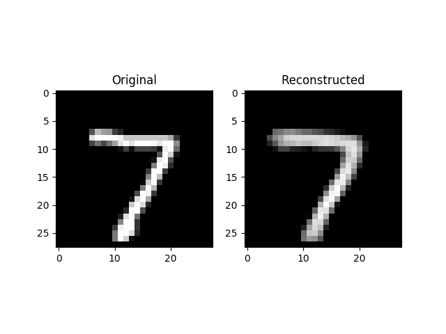

# Neural-net experimental code

## Description
* `mnist_cnn.py`
	* generate CNN trained to classify 28x28 greyscale images of singular digits 0-9

* `mnist_autoencoder.py`
	* generate MLP autoencoder for singular digits 0-9

## Sample output

### mnist_autoencoder.py

