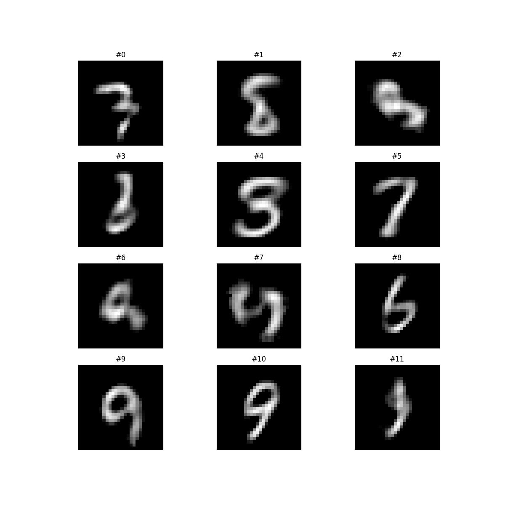
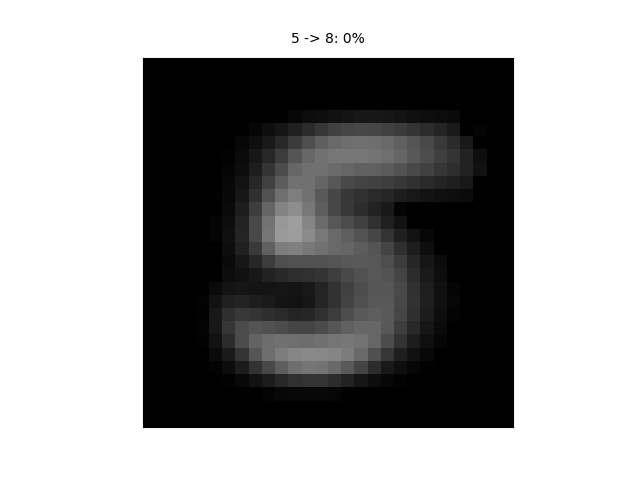

# Neural-net experimental code

## Description
* `mnist_cnn.py`
    * generate CNN trained to classify 28x28 greyscale images of singular digits 0-9
* `mnist_autoencoder.py`
    * generate MLP autoencoder for singular digits 0-9
* `mnist_generative_model.py`
    * adapted from the autoencoder, generates "new" number images from a 10x1 vector of arbitrary values

## Sample output

### mnist_autoencoder.py
* 
* The video moves kind of fast, so some frames of interest explained:
    * Error correction: 
    * Standardization (removing horizontal 7 bar): 

### mnist_generative_model.py
* Transfer: Arbitrary inputs
    * 
* Retrain: Use inputs matching training data digits
    * Fixed Integers: 
    * Hybrid Animation: 
